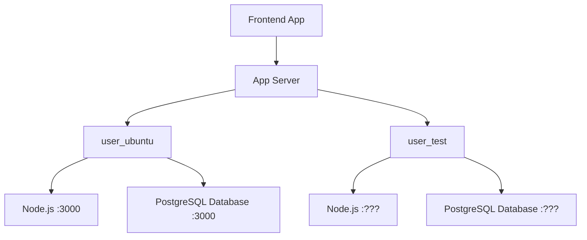
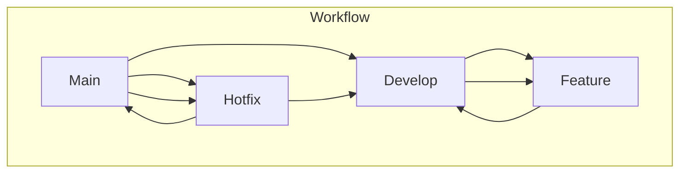

## server start

node ./app.js [port number]

# project_beyondPlus_backend

## 📁 Project Structure
<pre>
.  
|-- README.md  
|-- <b>UploadFiles</b> 
|-- app.js  
|-- <b>config</b>  
|    |-- database.js 
|    `-- passport.js  
|  
|-- <b>middleware</b> 
|   `-- authenticateToken.js  
|-- package-lock.json  
|-- package.json  
|-- <b>routes</b>  
|    |-- auth.js  
|    |-- comments.js  
|    |-- login.js  
|    |-- posts.js  
|    |-- timetables.js  
|    `-- uploadFiles.js  
`-- views  
    |-- comments.ejs  
    |-- login.ejs  
    |-- posts.ejs  
    `-- timetables.ejs</pre>

## ⚙️ Server Structure

## 🚩 Git Branch Structure

1. **Main Branch**:
   - Stable, production-ready code.
   - Only releases and critical hotfixes are merged into this branch.

2. **Develop Branch**:
   - Integration branch for features and hotfixes.
   - Reflects the latest development state.

3. **Feature Branches**:
   - Created for new features.
   - Originates from the `Develop` branch.
   - Merges back into `Develop` once complete.

4. **Hotfix Branches**:
   - Created for urgent fixes in production.
   - Originates from the `Main` branch.
   - Merges into both `Main` and `Develop` to keep the branches up to date.
  
## 📁 Database

**init table**

CREATE TABLE users (
    id SERIAL PRIMARY KEY,
    email VARCHAR(255) UNIQUE NOT NULL,
    password VARCHAR(255) NOT NULL,
    is_verified BOOLEAN DEFAULT FALSE,
    created_time TIMESTAMP DEFAULT CURRENT_TIMESTAMP
);

CREATE TABLE email_verification (
    id SERIAL PRIMARY KEY,
    email VARCHAR(255) UNIQUE NOT NULL,
    verification_code VARCHAR(6),
    expires_at TIMESTAMP,
    created_at TIMESTAMP DEFAULT CURRENT_TIMESTAMP
);

create table events(
id SERIAL PRIMARY KEY,
user_email VARCHAR(255) NOT NULL, 
title VARCHAR(10) not null, 
day VARCHAR(10) not null, 
startTime VARCHAR(10) not null, 
endTime VARCHAR(10) not null, 
Location VARCHAR(10) not null,
init_date    TIMESTAMP default CURRENT_TIMESTAMP not null,
CONSTRAINT fk_events_users FOREIGN KEY(user_email) REFERENCES users(email) ON DELETE CASCADE ON UPDATE CASCADE
);

CREATE TABLE posts (
  id SERIAL PRIMARY KEY,
  user_email VARCHAR(255) NOT NULL,
  title VARCHAR(255) NOT NULL,
  content TEXT NOT NULL,
  likes INTEGER DEFAULT 0,
  upload_time TIMESTAMP DEFAULT CURRENT_TIMESTAMP,
  CONSTRAINT fk_post_users FOREIGN KEY(user_email) REFERENCES users(email) ON DELETE CASCADE ON UPDATE CASCADE
);

CREATE TABLE comments (
  id SERIAL PRIMARY KEY,
  user_email VARCHAR(255) NOT NULL,
  content VARCHAR(255) NOT NULL,
  post_id INTEGER NOT NULL,
  likes INTEGER DEFAULT 0,
  upload_time TIMESTAMP DEFAULT CURRENT_TIMESTAMP,
  CONSTRAINT fk_comments_posts FOREIGN KEY(post_id) REFERENCES posts(id) ON DELETE CASCADE ON UPDATE CASCADE,
  CONSTRAINT fk_comments_users FOREIGN KEY(user_email) REFERENCES users(email) ON DELETE CASCADE ON UPDATE CASCADE
);

CREATE TABLE likes (
  id SERIAL PRIMARY KEY,
  user_email VARCHAR(255) NOT NULL REFERENCES users(email),
  comment_id INTEGER REFERENCES comments(id),
  UNIQUE(user_email, comment_id)  
);

CREATE INDEX users_email ON users USING btree(email);
INSERT INTO users (email, password, is_verified) VALUES ('master@student.uts.edu.au', 1234, true);

CREATE OR REPLACE FUNCTION generate_post_id()
RETURNS TRIGGER AS $$
BEGIN
  NEW.post_id := CONCAT('POST_', NEW.id);
  RETURN NEW;
END;
$$ LANGUAGE plpgsql;

CREATE TRIGGER set_post_id
BEFORE INSERT ON posts
FOR EACH ROW
WHEN (NEW.post_id IS NULL)
EXECUTE FUNCTION generate_post_id();

