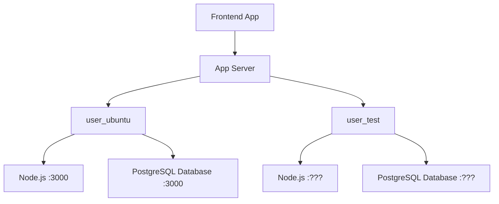
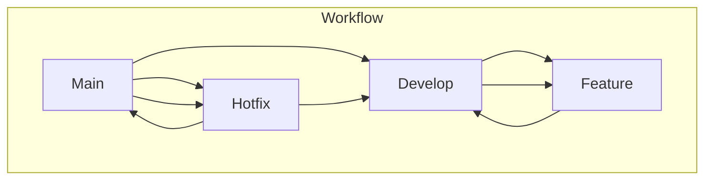

# project_beyondPlus_backend

## 📁 Project Structure
<pre>
.  
|-- README.md  
|-- <b>UploadFiles</b> 
|-- app.js  
|-- <b>config</b>  
|    |-- database.js 
|    `-- passport.js  
|  
|-- <b>middleware</b> 
|   `-- authenticateToken.js  
|-- package-lock.json  
|-- package.json  
|-- <b>routes</b>  
|    |-- auth.js  
|    |-- comments.js  
|    |-- login.js  
|    |-- posts.js  
|    |-- timetables.js  
|    `-- uploadFiles.js  
`-- views  
    |-- comments.ejs  
    |-- login.ejs  
    |-- posts.ejs  
    `-- timetables.ejs</pre>

## ⚙️ Server Structure

## 🚩 Git Branch Structure

1. **Main Branch**:
   - Stable, production-ready code.
   - Only releases and critical hotfixes are merged into this branch.

2. **Develop Branch**:
   - Integration branch for features and hotfixes.
   - Reflects the latest development state.

3. **Feature Branches**:
   - Created for new features.
   - Originates from the `Develop` branch.
   - Merges back into `Develop` once complete.

4. **Hotfix Branches**:
   - Created for urgent fixes in production.
   - Originates from the `Main` branch.
   - Merges into both `Main` and `Develop` to keep the branches up to date.

